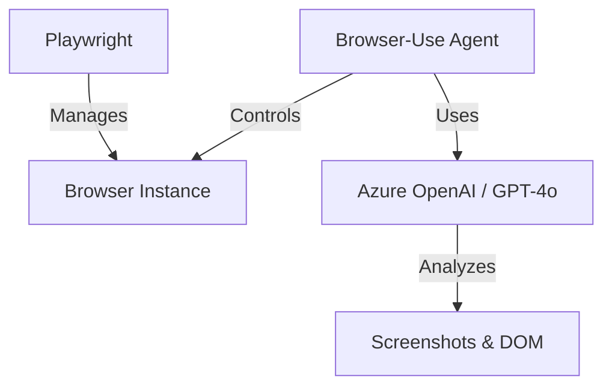

# Building Computer Use Agents (CUA) with Browser-Use

## Introduction

In this lesson, we explore how to build **Computer Use Agents (CUA)** that can autonomously interact with the web to perform complex tasks. We will use the **Browser-Use** library integrated with **Playwright** to create an agent that can search for Airbnb listings, analyze prices using vision, and find the best deals.

## Learning Goals

- **Understand** the "Agent vs Actor" pattern in web automation.
- **Implement** a browser agent using `browser-use` and Playwright.
- **Utilize** Vision-LLMs (like GPT-4o) to "see" and interpret web pages.
- **Extract** structured data (prices, ratings) from dynamic websites without brittle CSS selectors.

## Key Concepts

### Agent vs Actor Pattern

- **Agent:** The autonomous "brain" that navigates based on high-level goals (e.g., "Find a cheap hotel in Stockholm"). It handles dynamic layouts, pop-ups, and unexpected flows using AI.
- **Actor:** The deterministic "muscle" that performs precise actions (e.g., "Click button #submit"). It is faster and more reliable for known, stable interactions.

By combining these, we get the best of both worlds: AI for adaptability and Playwright for reliable execution.

### Browser-Use Library

[Browser-Use](https://github.com/browser-use/browser-use) is an open-source library that bridges the gap between LLMs and browser automation. It allows agents to:
- Perceive the browser state via screenshots and DOM trees.
- Plan and execute actions (click, type, scroll) to achieve a goal.
- Extract structured information using Pydantic models.

### Architecture

## Practical Example: Airbnb Price Search Agent

In the accompanying notebook (`15-browser-use.ipynb`), we build an agent that:
1.  **Navigates** to Airbnb.com using Playwright.
2.  **Searches** for "Stockholm, Sweden".
3.  **Analyzes** the search results page using GPT-4 Vision.
4.  **Extracts** all listing prices and details into structured data.
5.  **Identifies** the cheapest listing and calculates potential savings.

## Resources

- [Browser-Use Documentation](https://docs.browser-use.com/)
- [Playwright Python](https://playwright.dev/python/)
- [Azure OpenAI Service](https://azure.microsoft.com/en-us/products/ai-services/openai-service/)
